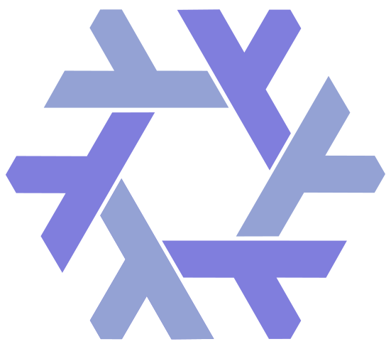
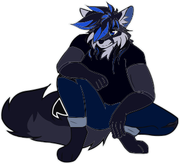

```coffeescript 
>>> readme = github.User(id=53050011).readme
<richformat.Markdown object at 0x4815162342>
>>> readme.show()
```

<br>
<p align="center">





<br>

<a href="https://hit.yhype.me/github/profile?user_id=53050011">
    
</a>

</p>

#  Hello, World!



I am a 21 yo French Epitech student learning 
[Full Stack](https://www.freecodecamp.org/news/what-is-a-full-stack-developer-back-end-front-end-full-stack-engineer/) 
Web Development, and a [Pythonista](https://www.linkedin.com/pulse/what-pythonistas-aakash-padhiyar).
I started coding at the age of 15 with the [Python programming language](https://www.python.org/), 
and my passion for design brought me to website creation.

I enjoy learning new things to become a better developer, always improving my 
code and my workflow. I believe in [Open-source](https://en.wikipedia.org/wiki/Open_source) 
and use [Nix OS](https://nixos.org) as my current operating system.


Know more about myself by taking a look over my [repositories](https://github.com/Sigmanificient?tab=repositories) and 
projects.

# <!-- Small line break, looking better than <hr/> -->

<br>

     [](https://wakatime.com/@175665bc-a6a0-4303-80ac-5a323cfb3ab4)

# <!-- Small line break, looking better than <hr/> -->

<br>

<details>
    <summary>Read more</summary>

<br>

I dedicate a part of my time to helping beginners find a way in the wild world 
of programming, or other developers to learn new skills. 
As such I am very proud of the work my friends [@drawbu](https://github.com/drawbu/),
[@vedsaga](https://github.com/Vedsaga/), [@VictorBetsch](https://github.com/VictorBetsch),
..., have been able to do with our hours of knowledge sharing.

I studied for 2 years at Fulbert’s high school, where I learn the fundamentals 
of [DevOps](https://en.wikipedia.org/wiki/DevOps/), database management 
and core skills of the [FullStack](https://en.wikipedia.org/w/index.php?title=Full_stack)
developer.
Currently, I'm studying at [Epitech School Of Technology](https://www.epitech.eu/)
to become an IT experts and master the field of computer science. Here, I will
learn me the C programming language to strengthen my low-level knowledge and 
make various projects to thoroughly improve my coding skills.

One of my biggest, yet personal project is [Pincer](https://pincer.dev), a 
library I created in 2022 to learn more about [websockets](https://en.wikipedia.org/wiki/WebSocket)
and [Discord API](https://discord.dev) that has received contributions from 
[amazing people](https://github.com/Pincer-org/Pincer/graphs/contributors). 
It had been a key project to teach me open-source organisation and way more has
been done than i could ever imagine.

</details>
