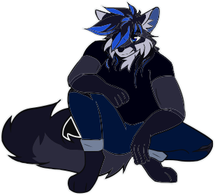

# Hi!

My name is [Yohann Boniface](https://www.linkedin.com/in/yohann-boniface/), I’m 19 a French student learning 
[Full Stack](https://www.freecodecamp.org/news/what-is-a-full-stack-developer-back-end-front-end-full-stack-engineer/) 
Web Development, and a [Pythonista](https://www.linkedin.com/pulse/what-pythonistas-aakash-padhiyar).   
Started Coding by age of 15 with the [python](https://www.python.org/) programming language, my passion for design
brought me to the website creation. 

I enjoy learning new things to become a better developer, always improving my code and my workflow. 
I believe in [Open-source](https://en.wikipedia.org/wiki/Open_source) and use [Arch-Linux](https://archlinux.org/) as my
current operating system.

Know more about myself by taking a look over my [repositories](https://github.com/Sigmanificient?tab=repositories) and 
projects.

Languages & Technologies I know, love & use 　　　　　　　　Stuff I’d like to learn this year

 　　 

I dedicate a part of my time to help beginners finding a way in the wild world of programming, or other 
developer to learn a new skill. As such I am very proud of the work my friends [@drawbu](https://github.com/drawbu/),
[@vedsaga](https://github.com/Vedsaga/) & 
[@reyfey](https://github.com/Reyfey/) have been able to do with our hours of knowledge sharing.

I am currently a student at Fulbert’s high school, (2nd year after Baccalaureate) where I learn 
[DevOps](https://en.wikipedia.org/wiki/DevOps/).
Planning for another 3 year of studying before searching for a Job as a 
[Front-End](https://en.wikipedia.org/wiki/Front-end_web_development) or 
[FullStack](https://en.wikipedia.org/w/index.php?title=Full_stack) developer.

Currently, my biggest project is [Pincer](https://pincer.dev), a library I created to learn more about 
[websocket](https://en.wikipedia.org/wiki/WebSocket) and
[discord API](https://discord.dev) that has received contribution from 
[amazing people](https://github.com/Pincer-org/Pincer/graphs/contributors). It had been a key project to teach
me open-source organisation and way more has been done than i could ever imagine.
